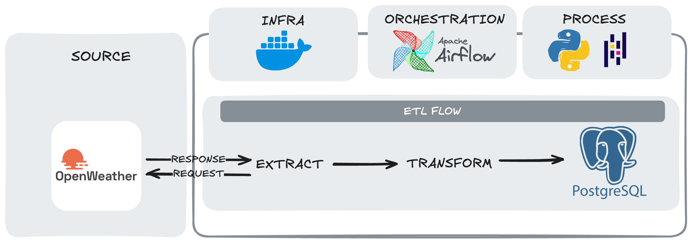
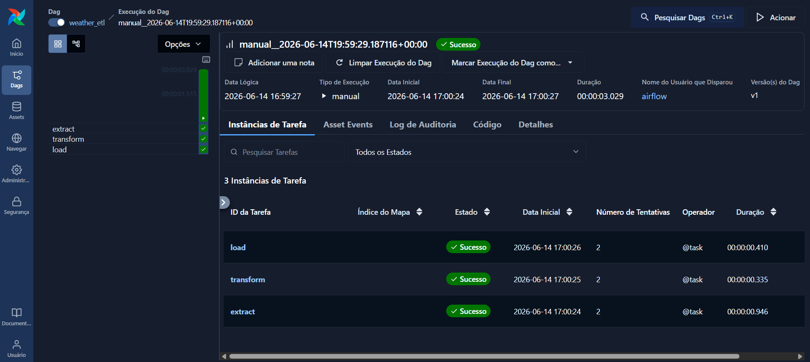
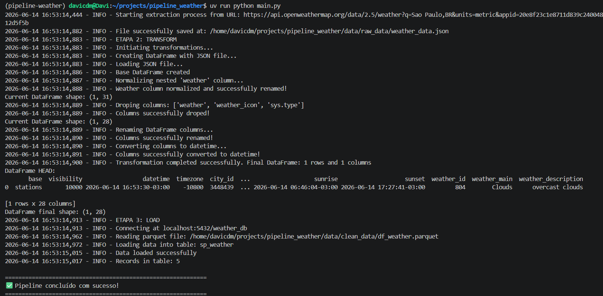
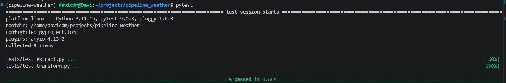

# 🌦️ Weather Pipeline - ETL Project

## 📌 Visão geral

Esse projeto é um pipeline ETL **(Extract, Transform, Load)** desenvolvido em Python para coletar dados meteorológicos da API OpenWeatherMap, processá-los e armazená-los em um banco de dados PostgreSQL.

O objetivo é simular um fluxo real de engenharia de dados, aplicando boas práticas de organização, documentação, modularização e testes, com as melhores práticas de Engenharia de Dados)

---

## ⚙️ Orquestração e infraestrutura

O pipeline ETL é orquestrado pelo **Apache Airflow**, enquanto a infraestrutura do ambiente é gerenciada via **Docker e Docker Compose**.


## ⚙️ Arquitetura do projeto
O pipeline é dividido em três etapas:

- **Extract**: coleta os dados brutos de clima da API OpenWeather
- **Transform**: realiza transformações tratando os dados brutos coletados
- **Load**: armazena os dados processados no PostgreSQL

---

## 🧱 Estrutura do projeto

```bash
pipeline_weather/
├── dags/
│   └── weather_dag.py
├── notebooks/
│   └── analysis.ipynb
├── src/
│   └── etl/
│       ├── __init__.py
│       ├── extract/
│       │   ├── __init__.py
│       │   └── extract_data.py
│       ├── transform/
│       │   ├── __init__.py
│       │   └── transform_data.py
│       └── load/
│           ├── __init__.py
│           └── load_data.py
│
├── tests/
│   ├── test_extract.py
│   └── test_transform.py
│
├── docker-compose.yaml
├── main.py
├── pyproject.toml
└── uv.lock
```
## 🛠️Tecnologias Utilizadas:

Core:
- **Python 3.11+** (linguagem principal)
- **Apache Airflow 3.2.1** (orquestração do pipeline ETL)
- **PostgreSQL** (banco de dados relacional)
- **Docker & Docker Compose** (infraestrutura e ambiente isolado)

Bibliotecas:
- **Pandas** (processamento e transformação de dados)
- **Requests** (requisições HTTP para a API)
- **JSON** (manipulação de dados no formato JSON)
- **SQLAlchemy** (conexão com banco de dados)
- **Pytest** (testes unitários)
- **psycopg2** (driver PostgreSQL)
- **python-dotenv** (gerenciamento de variáveis de ambiente)
- **ETL Package** (instale as funções ETL do projeto com "pip install e .")

Demais efrramentas:
- **Parquet** (armazenamento intermediário dos dados)
- **UV** (gerenciador de dependências Python)
- **Jupyter Notebook** (análise exploratória)

## 💻 Ambiente de desenvolvimento

- **VS Code** (editor de código)
- **WSL2** (Windows Subsystem for Linux)
- **Ubuntu** (ambiente Linux utilizado no desenvolvimento)

### 3️⃣ Configure as Variáveis de Ambiente

Crie um arquivo `.env` dentro da pasta `config/`:

```bash
# config/.env

# OpenWeatherMap API
API_KEY=sua_chave_api_aqui

# PostgreSQL (para testes locais)
user=airflow
password=airflow
database=airflow
```
---

## 🚀 Instalação e Configuração

### 1️⃣ Clone o Repositório

```bash
git clone https://github.com/davimegda/weather_pipeline.git
cd weather_pipeline
```

### 2️⃣ Obtenha sua API Key do OpenWeatherMap

1. Acesse [OpenWeatherMap](https://openweathermap.org/api)
2. Crie uma conta gratuita
3. Gere sua API Key no dashboard
4. Guarde sua chave para o próximo passo

### 3️⃣ Configure as Variáveis de Ambiente

Crie um arquivo `.env` dentro da pasta `config/`:

```bash
# config/.env

# OpenWeatherMap API
API_KEY=sua_chave_api_aqui

# Instale PostgreSQL no seu Ambiente:
Crie seu usuário/senha/database e armazene-os no arquivo .env juntamente com a variável da API_KEY
POSTEGRES_USER = seu_user
POSTEGRES_PASSWORD = seu_password
POSTEGRES_DB = nome_da_database

# Adicione também variáveis de host e porta:
DB_HOST = 'host.docker.internal'
DB_PORT = '5432'
```

### 4️⃣ Inicialize o Ambiente Airflow

```bash
# Crie a estrutura de pastas necessária
mkdir -p ./dags ./logs ./plugins ./config ./data ./src ./notebooks

# Configure as permissões (Linux/Mac)
echo -e "AIRFLOW_UID=$(id -u)" > .env
```

### 5️⃣ Inicie os Containers Docker

```bash

# Inicie todos os serviços
docker-compose up -d
```

Aguarde alguns minutos para todos os serviços iniciarem.

### 6️⃣ Verifique se tudo está rodando

```bash
docker-compose ps
```

Você deve ver todos os serviços com status **`healthy`** ou **`running`**:
- airflow-apiserver
- airflow-scheduler
- airflow-worker
- airflow-triggerer
- postgres
- redis

---

## 🎮 Como Executar

### 1️⃣ Acesse a Interface do Airflow

Abra seu navegador em: **http://localhost:8080**

**Credenciais padrão:**
- Username: `airflow`
- Password: `airflow`

### 2️⃣ Ative a DAG

1. Na interface do Airflow, localize a DAG chamada **`weather_pipeline`**
2. Clique no botão de **Acionar/Trigger** para ativá-la
3. A DAG está configurada para executar **a cada 1 hora**


---

## 🔍 Detalhamento das Etapas

### 📥 **ETAPA 1: EXTRACT**

**Arquivo:** [`src/etl/extract/extract_data.py`](src/etl/extract/extract_data.py)

**O que faz:**
1. Recebe 2 argumentos: URL_da_API + Caminho_de_Saída para os dados (Path object)
2. Faz uma requisição HTTP GET para a API do OpenWeatherMap
3. Valida o status code da resposta
4. Valida o diretório passado como argumento para a função
5. Salva os dados brutos em formato JSON com o nome "weather_data.json" no raw_dir especificado na DAG `data/raw_data/`
6. Retorna o caminho de saída completo incluindo o nome do arquivo como string (para passar como XCom para a próxima Task da DAG)

**Dados coletados:**
- Temperatura atual, mínima e máxima
- Sensação térmica
- Umidade e pressão atmosférica
- Velocidade e direção do vento
- Nível de nuvens
- Horários de nascer e pôr do sol
- Coordenadas geográficas

---

### 🔄 **ETAPA 2: TRANSFORM**

**Arquivo:** [`src/etl/transform/transform_data.py`](src/etl/transform/transform_data.py)

**O que faz:**

#### **Criação do DataFrame**
- Recebe como argumento: Recebe o caminho dos dados brutos salvos do return da função extract (string format)
- Valida o caminho do arquivo
- Carrega o arquivo JSON em um DataFrame do Pandas
- Normaliza dados aninhados usando `pd.json_normalize()`
- Retorna um DataFrame do Pandas parcialmente normalizado

#### **Normalização da coluna 'weather'**
- Recebe como argumento: O DataFrame parcialmente normalizado
- Passa a coluna `weather` (vem como lista de dicionários) para um DataFrame do Pandas e a normaliza
- Renomeia as colunas normalizadas para: `weather_id`, `weather_main`, `weather_description`, `weather_icon`
- Realiza um join com o DataFrame normalizado + Colunas da normalização de `weather`

#### **Remoção de colunas desnecessárias**
- Recebe como argumento:
- Remove a coluna aninhada 'weather' (resultado da sua normalização já foi adicionado ao DF pela transformação anterior) e demais colunas especificadas abaixo:
```python
columns_to_drop = ['weather', 'weather_icon', 'sys.type']
```

#### **Renomeação de colunas**
Padronização de nome de colunas para melhor legibilidade em inglês:
- `main.temp` → `temperature`
- `main.humidity` → `humidity`
- `coord.lon` → `longitude`
- `sys.sunrise` → `sunrise`
- E outros...

#### **Conversão de timestamps**
Converte colunas para datetime:
```python
columns_to_normalize = ['datetime', 'sunrise', 'sunset']

# Converte para datetime do fuso horário de São Paulo
    for name in columns_names:
        df[name] = (pd.to_datetime(df[name], unit='s', utc=True).dt.tz_convert('America/Sao_Paulo'))
```
#### **Remoção de colunas desnecessárias**
- Cria-se uma função transform_weather_data que chama todas as funções de transformação criadas anteriormente. Essa função:
- Recebe como argumento uma string (caminho de saída da função extract armazenada no XCom)
- Chama todas as funções para processar/transformar os dados brutos obtidos da OpenWeather API
- Define um diretório de saída para o DataFrame transformado ser armazenado como um arquivo Parquet
- Retorna o diretório de saída como string (que será armazenado no XCom para a próxima Task)
**Resultado:** DataFrame limpo, estruturado e pronto para análise

---

### 💾 **ETAPA 3: LOAD**

**Arquivo:** [`src/etl/load/load_data.py`](src/etl/load/load_data.py)

**O que faz:**

#### **Conexão com o banco de dados**
```python
engine = create_engine(
    f"postgresql+psycopg2://{user}:{password}@{host}:5432/{database}"
)
```

#### **Inserção dos dados**
```python
df.to_sql(
    name='sp_weather',
    con=engine,
    if_exists='append',  # Adiciona novos registros
    index=False
)
```

#### **Validação**
- Faz um `SELECT COUNT(*)` para verificar total de registros
- Loga o resultado para auditoria
---

## 📊 Fluxo da DAG no Airflow

**Arquivo:** [`dags/weather_dag.py`](dags/weather_dag.py)

### Configuração da DAG

```python
@dag(
    dag_id='weather_etl',
    start_date=datetime(2026, 6, 14, tz="UTC"),
    schedule="0 * * * *",
    catchup=False,
    description="ETL pipeline that extract weather data from OpenWeather API and stores raw JSON files",
    default_args={
        "owner": "airflow",
        "depends_on_past": False,
        "retries": 2,
        "retry_delay": timedelta(minutes=5)
    },
    tags=["etl", "weather", "pipeline"]
)
```

### Tasks Definidas

```python
@task
    def extract():
        file_path = extract_weather_data(url, raw_dir)
        return file_path

    @task
    def transform(file_path):
       clean_data_path = transform_weather_data(file_path)
       return clean_data_path

    @task
    def load(clean_data_path):
       load_weather_data(clean_data_path) 

# Dependências (equivalente à "extract() >> transform() >> load()")
    file_path = extract()
    clean_data_path = transform(file_path)
    load(clean_data_path)
```

**Por que usar Parquet entre transform e load?**
- Formato binário eficiente
- Preserva tipos de dados (datetime, float, etc.)
- Evita problemas com serialização do Airflow

---

## 🧪 Testes Locais (sem Airflow)

Para testar o pipeline sem Docker:

```bash
# Verifique se instalou todas as dependências
uv pip install -e .
```

```bash
# Execute o script de teste
uv run main.py
```


```bash
# Execute os testes unitários
uv run python pytest
```


> **Nota:** O arquivo `main.py` está comentado por padrão. Descomente para poder para usar.

---
